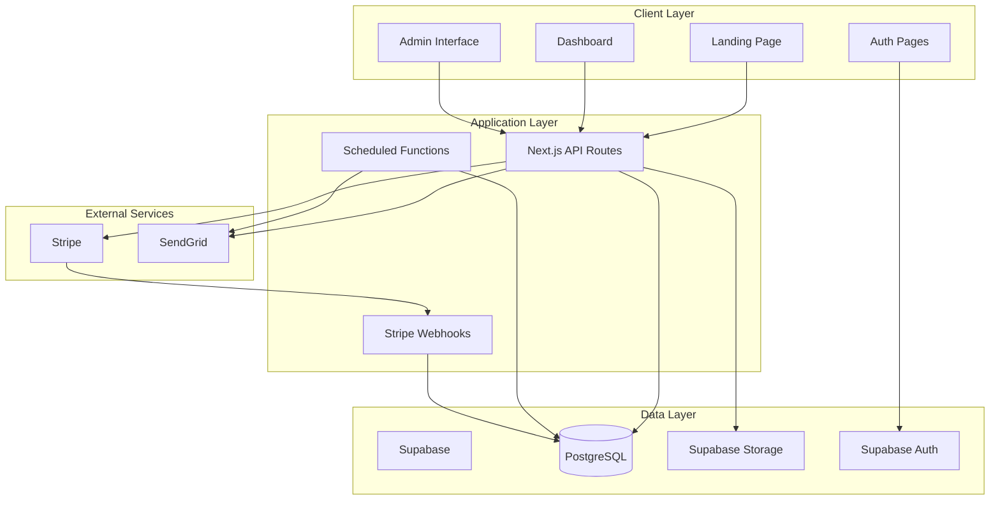

# Design Document - GTA Compliance Digest

## Overview

The GTA Compliance Digest is a SaaS platform built with Next.js, Supabase, and Stripe that provides compliance monitoring for landlords across GTA municipalities. The system follows a freemium model with event-driven email notifications for free users and comprehensive property management for paid subscribers.

### Architecture Principles

- **Ship fast, change-safe**: Typed APIs, database migrations, and feature flags
- **Minimal but extensible**: Start simple, design for growth
- **Security by default**: Row Level Security, least-privilege access, audit logging
- **Event-driven notifications**: Emails triggered by actual compliance updates, not arbitrary schedules

## Architecture

### System Architecture



### Technology Stack

- **Frontend**: Next.js 14 with TypeScript, Tailwind CSS
- **Backend**: Next.js API routes, Supabase client
- **Database**: PostgreSQL via Supabase
- **Authentication**: Supabase Auth
- **Storage**: Supabase Storage for document uploads
- **Payments**: Stripe with webhooks
- **Email**: SendGrid for transactional emails
- **Scheduling**: Vercel Cron or Supabase Edge Functions
- **Deployment**: Vercel

## Components and Interfaces

### Core Components

#### 1. Authentication System
- **Supabase Auth Integration**: Email/password authentication
- **User Management**: Profile creation with subscription tier selection
- **Session Management**: JWT tokens with automatic refresh

#### 2. Subscription Management
- **Stripe Integration**: Checkout sessions and subscription webhooks
- **Tier Management**: Free vs paid feature access control
- **Billing Portal**: Customer self-service via Stripe portal

#### 3. Property Management (Paid Users)
- **Property CRUD**: Add, edit, delete properties with validation
- **Deadline Tracking**: Automatic deadline calculation based on property type and city rules
- **Document Upload**: Secure file storage with expiration tracking

#### 4. Compliance Engine
- **Scoring Algorithm**: Deterministic scoring based on deadline proximity and status
- **Rule Engine**: City-specific compliance rules with configurable frequencies
- **Deadline Calculator**: Automatic deadline generation from property data and rules

#### 5. Email System
- **Template Engine**: Dynamic email generation with merge tags
- **Delivery Management**: Retry logic, unsubscribe handling, delivery tracking
- **Content Curation**: Rule update aggregation and personalization

#### 6. Administrative Interface
- **Content Management**: CRUD operations for cities, rules, and updates
- **Publishing Workflow**: Draft → Review → Publish for rule updates
- **Analytics Dashboard**: Subscriber metrics and email performance

### API Design

#### Public Endpoints
```typescript
// Authentication
POST /api/auth/signup
POST /api/auth/signin
POST /api/auth/signout

// Subscription
POST /api/stripe/checkout
POST /api/stripe/webhook
GET /api/stripe/portal

// Public content
GET /api/cities
GET /api/cities/[slug]/updates
```

#### Authenticated Endpoints
```typescript
// Dashboard
GET /api/dashboard

// Properties (Paid users only)
GET /api/properties
POST /api/properties
PATCH /api/properties/[id]
DELETE /api/properties/[id]

// Documents (Paid users only)
POST /api/documents
GET /api/documents/[id]/download
DELETE /api/documents/[id]

// User preferences
PATCH /api/user/preferences
```

#### Admin Endpoints (via Supabase Dashboard)
- Cities management
- Rules configuration
- Rule updates publishing
- User management and analytics

## Data Models

### Core Entities

#### Users and Subscriptions
```sql
-- Core user entity
users (
  id: uuid (PK),
  email: text (unique),
  plan: 'free' | 'paid',
  city_id: int (FK),
  created_at: timestamptz
)

-- Stripe subscription tracking
subscriptions (
  id: uuid (PK),
  user_id: uuid (FK),
  stripe_customer_id: text,
  stripe_subscription_id: text,
  status: 'active' | 'past_due' | 'canceled',
  plan_name: text,
  current_period_end: timestamptz
)
```

#### Geographic and Regulatory Data
```sql
-- Supported municipalities
cities (
  id: serial (PK),
  name: text,
  slug: text (unique),
  region: text,
  is_active: boolean
)

-- Compliance obligations by city
rules (
  id: serial (PK),
  city_id: int (FK),
  key: text, -- 'str_license', 'fire_inspection', etc.
  name: text,
  frequency_iso: text, -- ISO 8601 duration
  notes_markdown: text
)

-- Admin-curated compliance updates
rule_updates (
  id: serial (PK),
  city_id: int (FK),
  title: text,
  summary_markdown: text,
  effective_date: date,
  source_url: text,
  created_at: timestamptz,
  is_published: boolean
)
```

#### Property Management
```sql
-- User properties (paid users only)
properties (
  id: uuid (PK),
  user_id: uuid (FK),
  address_line1: text,
  city_id: int (FK),
  type: 'STR' | 'LTR',
  created_at: timestamptz
)

-- Calculated compliance deadlines
property_deadlines (
  id: uuid (PK),
  property_id: uuid (FK),
  rule_key: text,
  due_date: date,
  status: 'ok' | 'due_soon' | 'overdue',
  last_notified_at: timestamptz
)

-- Document storage tracking
documents (
  id: uuid (PK),
  property_id: uuid (FK),
  kind: 'license' | 'insurance' | 'inspection',
  file_url: text,
  expires_on: date
)
```

#### Audit and Analytics
```sql
-- Email delivery tracking
emails_sent (
  id: uuid (PK),
  user_id: uuid (FK),
  kind: 'city_digest' | 'personalized_digest' | 'due_soon',
  city_id: int,
  subject: text,
  sent_at: timestamptz
)
```

### Data Relationships

- Users belong to a city (for free digest targeting)
- Properties belong to users and cities
- Property deadlines are derived from properties and city rules
- Documents are attached to properties
- Rule updates are city-specific and drive email notifications

## Error Handling

### Client-Side Error Handling
- **Form Validation**: Real-time validation with clear error messages
- **API Error Display**: User-friendly error messages for common scenarios
- **Retry Logic**: Automatic retry for transient failures
- **Fallback States**: Graceful degradation when services are unavailable

### Server-Side Error Handling
- **Input Validation**: Comprehensive validation using Zod schemas
- **Database Errors**: Proper error mapping and logging
- **External Service Failures**: Circuit breaker pattern for Stripe/SendGrid
- **Rate Limiting**: Protect against abuse with appropriate limits

### Error Categories
```typescript
enum ErrorType {
  VALIDATION_ERROR = 'validation_error',
  AUTHENTICATION_ERROR = 'authentication_error',
  AUTHORIZATION_ERROR = 'authorization_error',
  PAYMENT_ERROR = 'payment_error',
  EXTERNAL_SERVICE_ERROR = 'external_service_error',
  INTERNAL_ERROR = 'internal_error'
}
```

## Testing Strategy

### Unit Testing
- **Business Logic**: Compliance scoring algorithm, deadline calculations
- **Utilities**: Email template rendering, date calculations
- **API Handlers**: Request/response validation and error handling
- **Database Functions**: Complex queries and data transformations

### Integration Testing
- **Authentication Flow**: Signup, signin, subscription creation
- **Payment Processing**: Stripe webhook handling and subscription updates
- **Email Delivery**: Template rendering and SendGrid integration
- **File Upload**: Document storage and retrieval

### End-to-End Testing
- **User Journeys**: Free signup → paid upgrade → property management
- **Email Workflows**: Digest generation and delivery
- **Admin Workflows**: Content publishing and user management

### Performance Testing
- **Database Queries**: Ensure efficient queries with proper indexing
- **Email Generation**: Batch processing for large subscriber lists
- **File Upload**: Large document handling and storage limits

### Security Testing
- **Row Level Security**: Verify users can only access their own data
- **Input Sanitization**: Prevent SQL injection and XSS attacks
- **File Upload Security**: Validate file types and scan for malware
- **API Security**: Rate limiting and authentication verification

## Compliance Scoring Algorithm

### Scoring Logic
```typescript
function calculateComplianceScore(property: Property, deadlines: PropertyDeadline[]): number {
  let score = 100;
  
  // Critical compliance items (-20 points each)
  const criticalRules = ['str_license', 'insurance', 'fire_inspection'];
  
  for (const rule of criticalRules) {
    const deadline = deadlines.find(d => d.rule_key === rule);
    if (!deadline || isWithin30Days(deadline.due_date)) {
      score -= 20;
    }
  }
  
  // Overdue items (-10 points each, max -40)
  const overdueCount = deadlines.filter(d => d.status === 'overdue').length;
  score -= Math.min(overdueCount * 10, 40);
  
  return Math.max(score, 0);
}
```

### Score Interpretation
- **90-100**: Excellent compliance
- **70-89**: Good compliance, minor attention needed
- **50-69**: Fair compliance, several items need attention
- **0-49**: Poor compliance, immediate action required

## Email System Design

### Template Architecture
- **Base Template**: Common header, footer, unsubscribe
- **City Digest Template**: Rule updates with source links
- **Personalized Template**: Property table with scores and deadlines
- **Due Soon Template**: Minimal alert format

### Delivery Strategy
- **Batch Processing**: Process subscribers in batches to avoid rate limits
- **Retry Logic**: Exponential backoff for failed deliveries
- **Unsubscribe Handling**: Immediate processing of unsubscribe requests
- **Bounce Management**: Automatic handling of bounced emails

### Content Personalization
- **Merge Tags**: Dynamic content insertion (name, property details)
- **Conditional Sections**: Show/hide content based on user tier
- **Localization**: City-specific content and terminology

## Security Considerations

### Data Protection
- **Row Level Security**: Supabase RLS policies for all user data
- **Encryption**: All data encrypted at rest and in transit
- **Access Control**: Principle of least privilege for all operations
- **Audit Logging**: Comprehensive logging of all data access

### File Security
- **Private Storage**: All uploaded documents in private buckets
- **Signed URLs**: Time-limited access to documents
- **File Validation**: Type and size validation on upload
- **Virus Scanning**: Integration with security scanning service

### API Security
- **Authentication**: JWT tokens with automatic refresh
- **Rate Limiting**: Protect against abuse and DoS attacks
- **Input Validation**: Comprehensive validation of all inputs
- **CORS Configuration**: Proper cross-origin request handling

## Performance Optimization

### Database Optimization
- **Indexing Strategy**: Optimize queries for user data and deadlines
- **Query Optimization**: Use efficient joins and avoid N+1 queries
- **Connection Pooling**: Efficient database connection management
- **Caching**: Redis caching for frequently accessed data

### Frontend Optimization
- **Code Splitting**: Lazy load components and routes
- **Image Optimization**: Next.js automatic image optimization
- **Static Generation**: Pre-generate static pages where possible
- **CDN**: Leverage Vercel's global CDN for asset delivery

### Email Performance
- **Batch Processing**: Process large subscriber lists efficiently
- **Template Caching**: Cache compiled email templates
- **Delivery Optimization**: Optimize send times for better engagement
- **Analytics**: Track delivery rates and engagement metrics